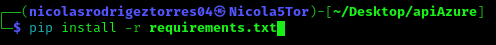
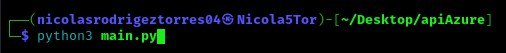

# COSMOS-LAS
Esta api fue diseñada para gestionar las acciones crud de la base de datos noSQl conocida como Cosmos
en azure, a continuación te muestro el paso a paso para usarla:

 1. Clona el repositorio y acto seguido dirigete a la carpeta donde se clonó
 2. Ve al archivo config y agrega las credenciales que se piden
 3. instala las librerias necesariasa, si ya las tienes omite este paso:
    
    

 4. Ejecuta el archivo main de la api en un entorno local

    

 5. Ya con la api en ejecución local lee la documentación para saber que servicio necesita

 # Documentación
 ## Crear Base de Datos
 Con el servicio tipo POST "/create_database" puedes crear bases de datos de manera rapida y sencilla
 solo debes enviar un parámetro
  {
 
    "name_Db" : "Nombre de la base de datos"
  }
  Si ya tienes la base de datos creada no es necesario invocar este servicio
 ## Crear Item
 Con el servicio tipo POST "/create_item" puedes crear items de manera sencilla, solo necesitas enviar en el header los siguiente parámetros.
	
 {
 
    "name_Db" : "Nombre de la base de datos",
    "name_item" : "Nombre del item",
    "partition" : "La partición del item",
    "container" : "Nombre del contenedor (no importa si está creado o no)"
    "item" : {Contenido que se quiere enviar a la base de datos}
  }
		
  ten en cuanta que la base de datos debe estar creada (el servicio ya agrega la fecha de creación)
  ## Consultar bases de datos creadas
  Con el servicio GET "/list_databases" podrás consultar las bases de datos que ya tienes creadas, no requiere argumentos
  ## Consultar contenedores creados 
  Con el servicio GET "/list_containers" podrá consultar los contenedores ya creados, solo necesitas enviar un parámetro
  {
  
    "name_Db" : "Nombre de la base de datos"
  }
  ## Consultar items creados
  Con el servicio GET "/list_items" podrá consultar los items ya creados, solo necesitas enviar dos parámetros
  {
  
    "name_Db": "Nombre de la base de datos",
    "container" : "Nombre del contenedor"

  }
  Cabe recalcar que aqui si afecta que el contenedor esté creado
  ## Consultar un item específico
  Con el servicio GET "/get_item" podrá consultar los items ya creados, pero unitatios, es decir items en específico, para esto  solo se necesitan 4 parámetros 
   {
   
     "name_Db":"Nombre de la base de datos",
     "container" : "Nombre del contnedor",
     "name_item" : "Nombre del item",
     "partition" : "partición del item"
   }
 ## Eliminar base de datos
 Con el servicio DELETE "/delete_database" podrá eliminar una base de datos en específico, para esto solo se necesita un parámetro.
 {
 
    "name_Db":"Nombre de la base de datos"
 }

 ## Eliminar Contenedor
 Con el servico DELETE "/delete_container" podrá eliminar un contenedor en específico, para esto solo se necesitan dos parámetros 
 {
 
     "name_Db":"Nombre de la base de datos",
     "container" : "Nombre del contnedor"
 }
 ## Eliminar Item
 Con el servicio DELETE "/delete_item" podrá eliminar un item en específico, para ello se necesitan 
 cuatro items
  {
  
     "name_Db":"Nombre de la base de datos",
     "container" : "Nombre del contnedor",
     "name_item" : "Nombre del item",
     "partition" : "partición del item"
   }

 

